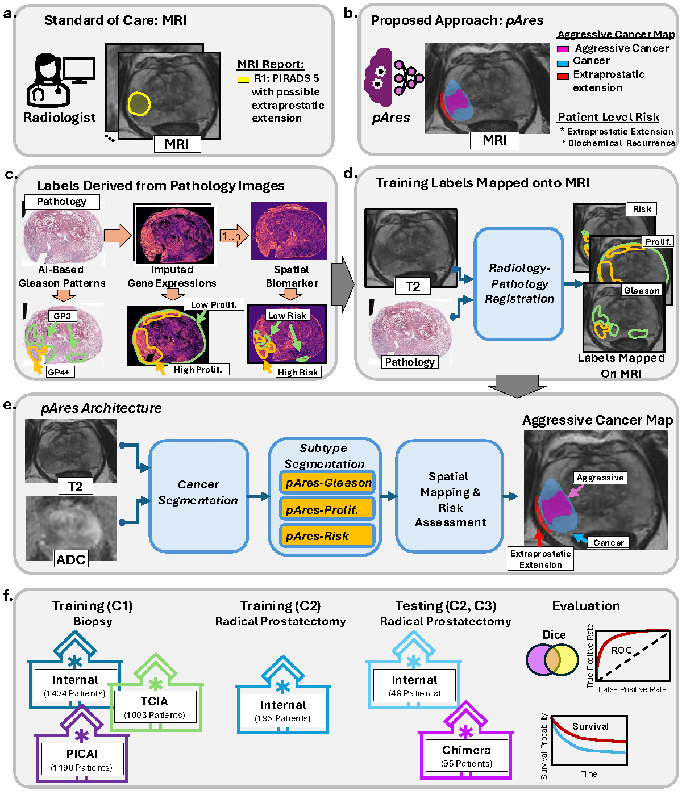

# Repository for pares
This is the inference code for pAres, the tool made available as part of the study titled:
 "Aggressive Cancer Subtype Detection on Prostate MRI via Radiology-Pathology-Genomic Learning" by Rusu. et. al. 2026 that is currently under review.

The code shows how to run the inference in pAres for a case from the Chimera challenge cohort.

Approach summarized here:  

# How to run

## get the code

`git clone https://github.com/pimed/pares.git`

## Download the model weights (only needed once)

The models will be made available upon manuscript acceptance [here](https://stanfordmedicine.box.com/s/95a0n0jfxz8ksizylv4puf75bw177esx). 
Accession denied messages indicates that you don't have access to download the weights at this time. 
Please send a data access request to [mrusu@stanford.edu](mailto:mrusu@stanford.edu).  

## Unzip the model weights

`mkdir models`

`cp path\to\models\*.tgz models` or `$ cp path\to\models\*.tar models` 

`tar -xvzf Dataset202.tar; tar -xvzf Dataset203.tar; tar -xvzf Dataset361.tar; tar -xvzf Dataset309.tar; cd ../` 

or

`tar -xvzf Dataset202.tgz; tar -xvzf Dataset203.tgz; tar -xvzf Dataset361.tgz; tar -xvzf Dataset309.tgz; cd ../`

## Create and prepare enviroment

`python3 -m venv pares_env`

`source pares_env/bin/activate`

`cd path\to\pares_code`

`pip install -r requirements.txt`

## Execute unit test

`$python test_one_case.py`

## Expected features for unit test

Features computed from the different regions:

pro : 43736.438 
csp :  7306.848 
agg : 10298.341 
prf :  6382.152 
met :  5588.352 
hi3 :  3859.812 
hi1 :  9194.473 
ind :  1423.980 
cln :  1362.744 

values can be off by 1-2 $mm^3$. 

Features computed from the different regions

If you obtained these results, then the code run succesfully, and you can run either the entire chimera data using file `test_chimera.py` or your data. 

## Notes that the 'test_chimera.py'

The chimera data is not available with this repository, so please download it from [here](https://chimera.grand-challenge.org/). This file assumes that the T2 and ADC files follow the chimera template with 'T2' and 'ADC' in the filename. Other inputs will cause the script not to work. We recommend you write a separate test_YourData.py file that read the right files for your data.  

## Output 

Multiple file and features are output. The files are either labels (discrete values, 0,1, 2* - sometimes), or probablities (values from 0-1), and whether is one or the other, is indicated by the key word: label vs. prob

Output region abbreviations:

- pro - prostate
- csp - clinically significant cancer
- agi - Aggressiveness defined by ISUP Grade group (GG). Includes both GG=1 - indolent, GG>=2 as value 2 - aggressive.
- agg - only includes aggressive label, so values >=1 are aggressive (GG>=2)
- prf - proliferation as indicated by Ki67
- met - marker of metastasis that combines ~200 genes 
- mpa - three labels in one file, metastsis proliferation and aggressive by GG
- cln - contact line - defined as dilation of where all 3 labels aggree, is within 3mm of the prostate boundary   

## Postprocessing or filtering - indicated by "\_f\_" in the filename

To reduce false positives in the aggressive labels predictions, we filter the results using the csPCA labels where are trained with a lot larger and more diverse dataset. Filtering is basic, including checking whether these is at lease 1\% overlab between a predicted aggressive label and the a predicted clinically sifnificant cancer label. 

# FAQ

1. Why output the prostate probability?

We output the prostate probablility from the csPCA model because is used as input for the aggressive models. If labels maps are needed, then the probability should be thresholded at 0.5 and all values larger than 0.5 should be considered the prostate.

2. why did you compute the contact line based on the three labels? 

The contact line is a surrogate for where the cancer is more likely to go outside the prostate and have extraprostatic extensions. Anticipating that the more aggressive cancers are more likely to have extraprostatic extenions, then we simply check whether the aggressive cancer is closer then 3mm from the prostate boundary. We thereby depict the contact line outside the prostate boundary.  

# Contact

Code created by Mirabela Rusu ([mirabela.rusu@stanford.edu](mailto:mirabela.rusu@stanford.edu))